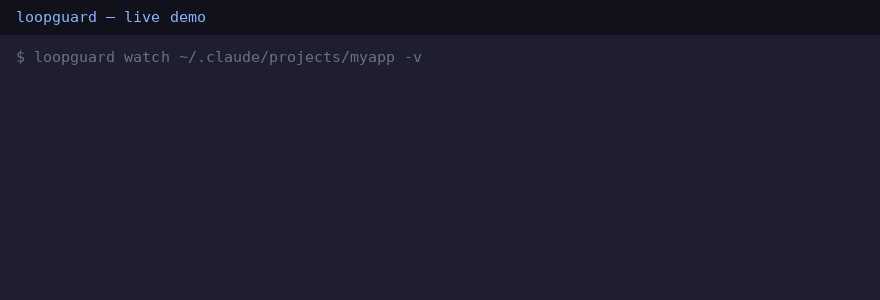

# loopguard

**Stop agent loops before they burn your tokens.**

AI CLI agents (Claude Code, etc.) sometimes get stuck repeating the same tool call—`bash ls -la`, `bash ls -la`, `bash ls -la`—or oscillate between two actions while you're away from your desk. `loopguard` watches the session transcript and alerts you before the damage compounds.

---

## The pain

> "Wait, actually…" — your agent, for the fifth time in a row.

- Agent loops on the same `bash` command because the output never changes.  
- Agent oscillates: read → write → read → write, forever.  
- Agent stalls for 5 minutes because a tool hung and nobody noticed.  
- You come back to a blank terminal, 2,000 token burn, and zero progress.

---

## Install

No dependencies. Stdlib only. Python 3.10+.

```bash
curl -fsSL https://raw.githubusercontent.com/ruslanlap/loopguard/main/loopguard.py \
  -o ~/.local/bin/loopguard && chmod +x ~/.local/bin/loopguard
```

(`~/.local/bin` must be on PATH; `mkdir -p ~/.local/bin` if it doesn't exist. Or just `git clone` and run `./loopguard.py`.)

---

## Usage

```bash
# Watch a specific transcript file (tail from end, poll every 2s)
loopguard watch ~/.claude/projects/my-project/session.jsonl

# Watch a whole project directory (picks newest .jsonl automatically)
loopguard watch ~/.claude/projects/my-project/

# Analyse existing file and exit immediately (CI / tests)
loopguard watch session.jsonl --once --from-start

# Process from beginning (not just new lines)
loopguard watch session.jsonl --from-start
```

### Telegram alerts

Set two environment variables and loopguard will ping you:

```bash
export LOOPGUARD_TG_TOKEN="123456:ABC-your-bot-token"
export LOOPGUARD_TG_CHAT_ID="987654321"
loopguard watch ~/.claude/projects/
```

---

## Detectors

| Detector     | Default trigger                               | Flag to tune             |
|--------------|-----------------------------------------------|--------------------------|
| **LOOP**     | Same tool+args 3× in last 20 events           | `--loop-n N --loop-m M`  |
| **OSCILLATION** | A→B→A→B pattern (4 events, 2 unique)       | _(not yet tunable)_      |
| **STALL**    | No new lines for 300 s while file is idle     | `--stall-s S`            |

One alert per incident. Resets automatically when a new unique tool call appears.

---

## Exit codes

| Code | Meaning                                |
|------|----------------------------------------|
| `0`  | Healthy (used with `--once`)           |
| `1`  | Incident detected (used with `--once`) |
| `2`  | Usage error                            |

---

## Running the tests

```bash
python3 -m unittest discover -s tests
```

---

## Demo


